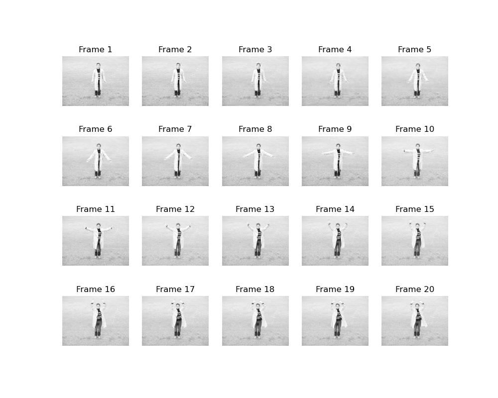
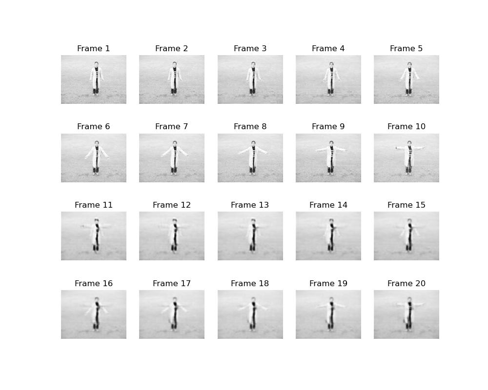

# Video_Prediction_using_SimVP
[HYU CVlab] Research on how to predict future video sequences through deep learning methodology by extracting underlying patters from natural video.

Research on how to predict future video sequences through deep learning methodology by extracting underlying patters from natural video.

Research on a more practical and reasonable Video Prediction Modeling and Application based on "SimVP(CVPR2022)" thesis as the 1st project at HYU CVlab.

## Contents
### Caltech

### kth

## Dependencies
* torch
* scikit-image
* numpy
* argparse
* tqdm
* cuda

## Overview

* `API/` contains dataloaders & metrics & recoders
* `main.py` is the executable python file with possible arguments.
* `model.py` contains the model.
* `modules.py` contains the layer & unit cells to construct model.
* `exp.py` is the core file for training, validating, and testing pipelines.
* `utils.py` contains various method & custom function for overall codes.
* `evalutation.py` is the evaluation codes by test dataset   
* `visualization.py` is a comprehensive file that collects methods related to visualization.

---------
